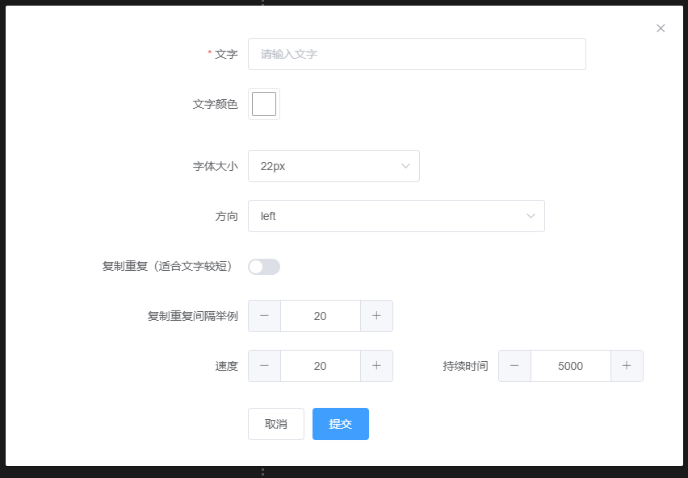

本项目是直播辅助软件 [Stage](https://github.com/hongbing2017/stage) 的开源插件仓库。

Stage的插件以独立HTML页面为载体，并以iframe的形式调用展示。

所以，如果你发现某个CSS动画或者HTML5效果可以用于直播，最简单的插件开发方式只需要把它封装成独立的网页就行了。

当然，有些插件需要用户提供参数来调整显示效果，有些还需要主播实时控制来决定插件的动态效果，因此Stage也约定了一些开发规则。


# 基本开发

下面这个HTML模板可以帮你迅速开发出最简单的插件：
```html 
<!DOCTYPE html>
<html lang="en">

<head>
  <meta charset="utf-8">
  <meta name="viewport" content="width=device-width, initial-scale=1.0">
  <meta http-equiv="X-UA-Compatible" content="ie=edge">
  <title>your plugin name</title>

<body>
  <div>plugin content</div>
</body>

</html>
```

这完全就是一个最普通的网页，你只需要把它以index.html名字保存，并且把plugin content部分改为自己想要实现的页面即可。

stage使用这个插件时会一式两份，分别在直播窗口和控制窗口插入一个iframe调用此网页。

如果你的网页内容是一个复杂的动画，那么在控制窗口显示相同的内容是没必要的，那会占用电脑性能，更好的方式是在控制台窗口的插件实例不显示动画，仅仅简单显示文字使用说明，表明这是一个什么插件即可。

为了区分插件到底在哪边显示，Stage在调用插件时会提供一个bMange参数，如果等于true表示插件实例位于控制台窗口，否则位于直播窗口,插件开发者可以通过这个参数提供不同的显示内容。

一个区分显示的插件类似这样：

```html
<!DOCTYPE html>
<html lang="en">

<head>
  <meta charset="utf-8">
  <meta name="viewport" content="width=device-width, initial-scale=1.0">
  <meta http-equiv="X-UA-Compatible" content="ie=edge">
  <title>your plugin name</title>
  <script src="https://cdn.staticfile.org/jquery/2.1.4/jquery.min.js"></script>

  <script type="text/javascript">
    $(function () {
      let url = location.href;
      let param = url.split('param=')[1] || ''
      param = decodeURIComponent(param)
      param = JSON.parse(param)
      console.log("param:", param)
      
      if(param.bManage){
        $('body').html('这个插件用于测试') //开发者可以修改这里改变插件在控制窗口的显示
        return;
      }
      
    })
  </script>
</head>

<body>
  <div>plugin content</div>
</body>

</html>
```
可以看出，仅仅多了url解析参数部分，然后根据参数里的bManage分别构造显示内容。

# 插件参数

在实际使用中，很多插件要求用户提供自定义参数来决定具体显示效果。

Stage除了按上述方式传递bMange,也可以同时传递自定义参数，但前提是开发者必须提前描述自己需要用户填写什么参数。

这个工作是通过开发者定义schema.js来完成的。
 
我们规定，每一个插件需要在相同目录下提供一个schema.js，即便是一个插件不需要用户填写自定义参数也要提供一个空的schema.js, 比如如下内容：

```js
 return {
  "formDesc": {
    //空的表单描述
  }
}
```

schema.js本质上提供了一个表单对话框的描述，stage通过调用这个生成表单对话框供用户填写参数，比如滚动文字插件的schema.js如下：
```js
 return {
  "formDesc": {
    "text": {
      "label": "文字",
      "type": "input",
      "required": true
    },
    "fontColor": {
      "label": "文字颜色",
      "type": "color",
      "default": "#FFFFFF",
      "layout": 23
    },
    "fontSize": {
      "options": [
        {
          "text": "18px",
          "value": "18px"
        },
        {
          "text": "22px",
          "value": "22px"
        }
      ],
      "label": "字体大小",
      "type": "select",
      "default": "22px",
      "layout": 16
    },
    "direction": {
      "options": [
        "left",
        "right",
        "up",
        "down"
      ],
      "label": "方向",
      "type": "select",
      "default": "left",
      "layout": 22
    },
    "duplicated ": {
      "label": "复制重复（适合文字较短）",
      "type": "switch",
      "layout": 21
    },
    "gap": {
      "label": "复制重复间隔举例",
      "type": "number",
      "default": 20,
      "layout": 24
    },
    "speed": {
      "label": "速度",
      "type": "number",
      "default": 20,
      "layout": 12
    },
    "duration ": {
      "label": "持续时间",
      "type": "number",
      "default": 5000,
      "layout": 12
    }
  }
}
```
stage调用此插件后会自动这么显示给用户：




插件开发者如何根据自己所需的自定义参数生成schema.js呢？ 请参考：https://github.com/dream2023/vue-ele-form-generator ，它提供了在线表单设计工具，开发者通过这个工具设计好自己的表单后，把表达数据插入shcema.js即可。

# 实时控制

除了提供静态参数，Stage还允许主播通过位于控制台窗口的插件实例去实时控制直播台的另一个插件实例。

比如对于一个下棋游戏插件，主播在控制台点击插件实例的开始按钮，那么在直播台的插件实例就会得到通知，然后做好新一轮游戏的准备。

这要求分属两个窗口的实例能相互通讯，并且这种通讯必须与stage在逻辑上解耦，开发插件的人不需要了解它们在Stage内部是如何实现通讯的，只需要按规范发送和处理数据即可。

下面就是这种插件的开发模板：
```html
<!DOCTYPE html>
<html lang="en">

<head>
  <meta charset="utf-8">
  <meta name="viewport" content="width=device-width, initial-scale=1.0">
  <meta http-equiv="X-UA-Compatible" content="ie=edge">
  <title>your plugin name</title>
  <script src="https://cdn.staticfile.org/jquery/2.1.4/jquery.min.js"></script>
<script>
function initWebsockt() {
    var ws = new WebSocket(`ws:/127.0.0.1:5432/?name=${document.name}&bManage=${document.bManage}`);

    ws.onopen = function (e) {
      console.log('Connection to server opened:' + ws.readyState);
    }
    ws.onmessage = function (evt) {
      let data = JSON.parse(evt.data)
      if(document.bMange){
        //处理控制窗口发来的信息
      }else{
        //处理直播窗口发来的信息
      }   
    }
    ws.onclose = function (evt) {
      console.log("WebSocketClosed:", that.name);
    };

    document.ws = ws
}
<script type="text/javascript">
    $(function () {
      let url = location.href;
      let param = url.split('param=')[1] || ''
      param = decodeURIComponent(param)
      param = JSON.parse(param)
      console.log("param:", param)
      
      initWebsockt()

      if(param.bManage){
        $('body').html('这个插件用于测试') //开发者可以在这里
        return;
      }
      
    })
</script>
</head>

<body>
  <div>plugin content</div>
</body>

</html>
```

可以看出，它只是多了一个websoket的处理，同一个插件根据bMange做到角色区分处理收到的信息。

注意：使用websoket相互发送信息时，每一个信息必须包含name和bManage两个数据，它的值已经在stage调用时传递给了插件。

比如类似这样：

```js
//初始化时从参数得到插件实例的名字和角色
document.bManage = param.bManage
document.name = param.pluginName

....

//任何时候发送消息都需要带上插件实例名字和角色
if(document.ws && document.ws.readyState ==1){
    document.ws.send(JSON.stringify({
      name:document.name, 
      bManage:document.bManage, 
      type:'status',
      text:'this is a message'
    }))
}
```
信息的其它内容由开发者自己定义，具体案例可以参考 [五子棋插件](https://github.com/hongbing2017/stageplugin/tree/master/%E4%BA%94%E5%AD%90%E6%A3%8B)

-----

总结一下：开发一个stage插件，就是提交一个 index.html 和  schema.js。

欢迎大家把自己觉得有意思的东西做成插件提交此仓库，互通有无，如果你的插件花了大量精力，也可以私有收费，Stage允许本地调用插件。
